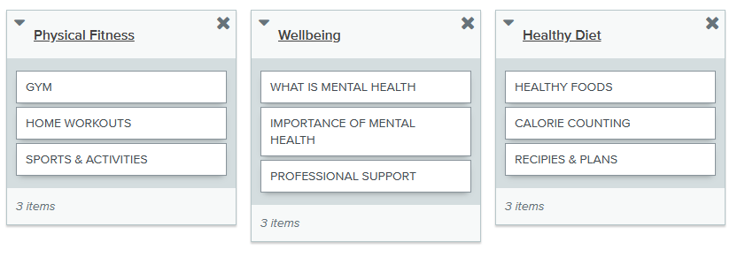
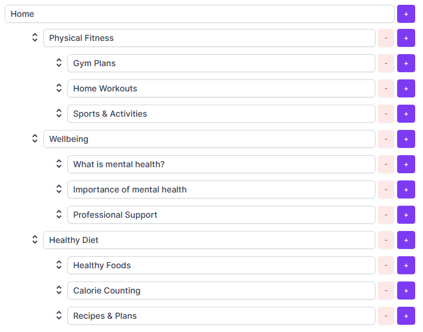

# Information Architecture Report

**Word count** 800 words maximum

## Card sort

### Introduction

Card sorting is a method used to help design and analyse the information architecture of a site. In numerous card sorting sessions, we asked participants to orgsnise our topics into categories that make sense to them and they may also help you label these groups

### List of the card elements

- Gym workouts 
- Recipes and meal plans
- Home workouts 
- What is mental health?
- Importance of mental health
- Healthy foods
- Sporting activities
- Professional support 
- Calorie counting

### Cart sort results

---

## Tree testing

### Introduction

Once you have an architecture you like, test it out with a tree testing exercise, again on paper or using Optimal Workshop Treejack (online) on a number of people.

### Illustration of the architecture tested

### Tree testing results

Illustrated summary of your findings.

---
